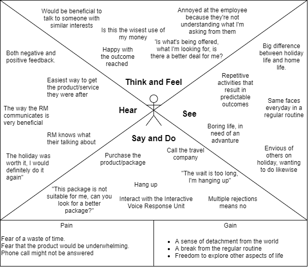
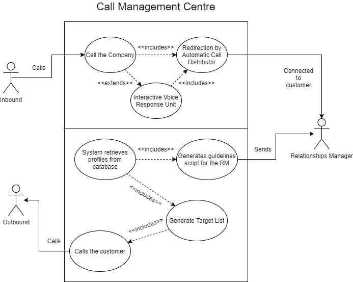
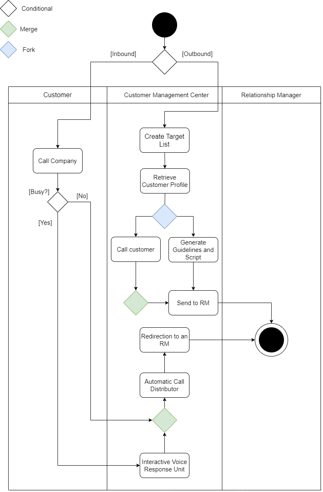
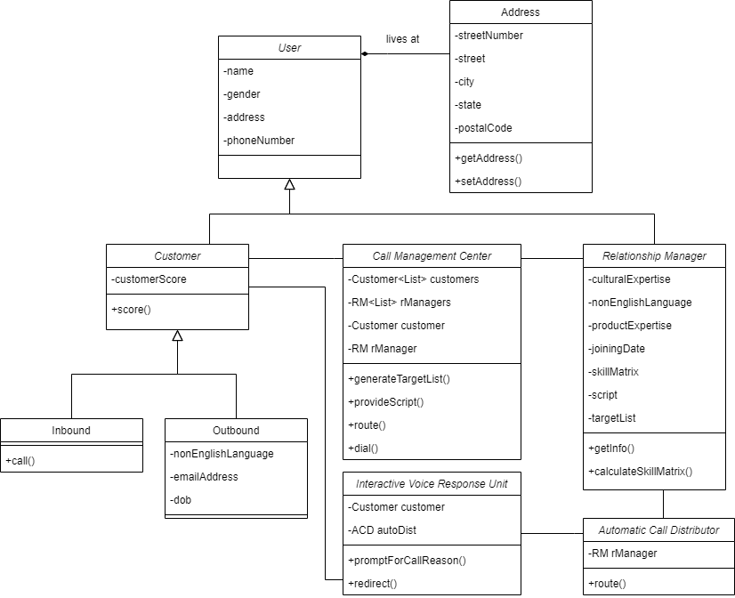
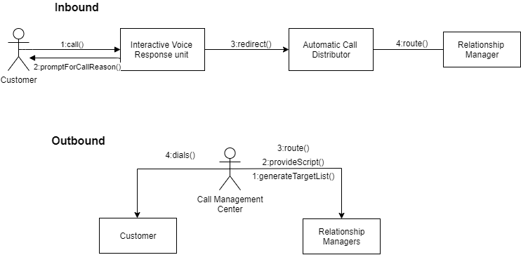

**Empathy Map**

**Problem Definition:**

To allocate Relationship Managers (RMs) to customers in the most efficient way possible, to achieve the greatest rate of sales per number of calls (for inbound and outbound calls), while reducing waiting times of customers (for inbound calls).

**List of Stakeholders:**

- Relationship Managers (RMs)
- End-Customers/Potential Customers
- Major Travel Company’

**POV Statement:**

1. As a customer, I want to talk to a representative who has a similar perspective, such as a common culture or language, so that I get the best possible product recommendation and purchase.
2. As a customer, I want to be connected to the RM with the highest likelihood of success as measured through a criteria.
3. As an RM, I want to be connected to the customer with the highest score possible because I want to maximise the likelihood of a successful sale.
4. As an RM, I want to be given customer personalised guidelines and a script based on all available information to help me improve the service.

Inbound:

1. As a customer, I want to be connected to a representative as quickly as possible to save time.
2. As a customer, I want minimal interaction with the Interactive Voice Response unit because while necessary, it is an annoying experience.
3. As a customer, I want to be connected to the representative that is most likely to be knowledgeable about the inquiry (e.g travel location) so they can more effectively assist me. (See Assumption 3).

Outbound:

1. As a customer, I only want to be contacted by the company for a recommendation of a product that I&#39;m likely to be interested in so as to avoid unnecessary calls. (See Assumption 1)
2. As a customer, I want to be contacted at a time when I am likely to be available for a conversation because otherwise I will be disturbed and won&#39;t be able to respond.
3. As a customer, I don&#39;t want to be contacted if I have repeatedly shown a lack of interest in purchasing a product. (See Assumption 2)
4. As an RM, I want my schedule of end-customer calls and estimated call durations to be based on my skill level and past performance to ensure that I can assist the maximum number of customers in the available time.

**Assumptions:** 

1. The system makes the proposed product of a customer based on the customer profile, which has the information needed to make said proposal.
2. The score of the customer is impacted (lowered) if they show a lack of interest in purchasing a product by hanging up, repeatedly declining a purchase, etc.
3. When inquiring about the reasons for the call, The Interactive Voice Response unit asks about travel location interests (e.g. continent) and the Automatic Call Distributor uses that information in its routing process to an appropriate RM.

**Reflection:**

Many assumptions were made throughout the user story writing process. These assumptions were necessary for a functioning potential system but were not included in the project specification. There were 3 of these assumptions, and here are the descriptions of each one.

Assumption 1 : The project specification tells us that the proposal for a product is generated using the customer's information but it does not tell us, in the case of insufficient information, the legitimacy of the recommendation, so the first assumption assumes that the system has all the information needed to make a legitimate recommendation.

Assumption 2: The project specification tells us that the customer has a score, that the score is determined by the customer's likelihood to purchase the product and it gives a few examples of things that would impact the score. This assumption states that the customer's expression of a lack of interest is used in the criteria for his/her score.

Assumption 3: The Interactive Voice Response unit, according to this assumption, asks among other things the travel destination the customer is interested in and the Automatic Call Distributor uses that information among the rest in its judgement of the most appropriate RM for the customer.

**'How Might We' statements**

1. How might we ensure that the criteria used for the RM selection will have the highest possible chance of connecting the customer to the most effective RM?
2. How might we balance the connection with the customer based on their likelihood to make a purchase (customer score) with the necessity of connecting him/her to the most effective RM?
3. How might we generate a script for the RM that will be most effective in achieving a sale in the call?
4. How might we connect the customer to the RM to lessen the amount of time they spend waiting?
5. How might we make the Interactive Voice Response Unit a more pleasing experience and effective use of the customers&#39; time?
6. How might we make use of the Interactive Voice Response Unit to acquire the most useful information to connect the customer to the most knowledgeable RM?
7. How might we develop the customer profiling tool to increase the accuracy of customer matching with the RM?
8. How might we ensure that the customer isn't contacted for the sale of products they are unlikely to be interested in?
9. How might we coordinate the calls such that *all* of the customers are called at times when they are most likely to be available in?
10. How might we, using past behaviour, determine whether or not the customer is interested in a certain product?
11. How might we use the skill level and the past experience of the RMs to make a schedule for them so as to maximise their number of calls?

**Use Case Diagram:**

**Activity Diagram:**

**Class Diagram:**

**Collaboration Diagram:**

**Project Reflection:**

Our team used the agile Scrum methodology throughout the report creation process, including the various UML diagrams. A big part of this was using the Github version control software. This helped us keep track of the various versions of the report, through branches, as well as storing the various historical versions of our report through commits. This allowed us to keep track of the work that had been done and whom it was done by. We combined the Scrum methodology with our use of Github in a very organised way. Here is how.

In the Scrum methodology, there are 3 roles: Product Owner, Scrum master, and the Development team.

- The Scrum master was Davit Gevorgyan and his role was to facilitate communication between the product owner and the development team by asking the necessary questions and developing them into use cases for the team to follow. As the Scrum master, he was also responsible for accepting the merge pull requests from other branches into the master branch on Github, as well as solving any merge conflicts that would arise.

- The development team consisted of Davit Gevorgyan, Maria Herrera, Sevag Keoshgerian and Aminul Islam Rafi. They were responsible for developing the items on the product backlog, which were represented in the “Issues” functionality on Github. After committing a certain task to the repository, the member of the dev team would mark the issue that was closed by it as “closed” and include the commit number in the closing comment of the issue. This made it easier for us to track down when anything was completed.

- The product owner was Muhammad Atif Qureshi, who answered the questions about the product and about the information system we are tasked with making.

The team also strictly followed the sprint system of the Scrum methodology. The sprints were 1 week long and we had tasks on the backlog which we had to complete each sprint. We had 3 prints in total, week 1, week 2 and week 3-4 (combined into one). The backlog items were the ones listed in the “Issues” section on Github, and strict allocation of who needed to do what wasn’t assigned since we worked on nearly all aspects of the report live on call as a group.
